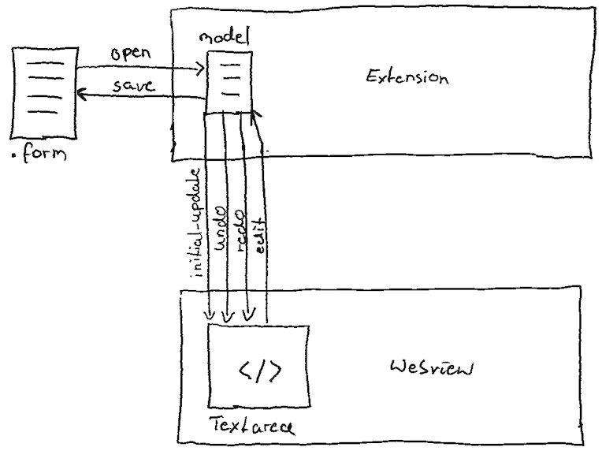

<div id="top"></div>
<!--
*** Thanks for checking out the Best-README-Template. If you have a suggestion
*** that would make this better, please fork the repo and create a pull request
*** or simply open an issue with the tag "enhancement".
*** Don't forget to give the project a star!
*** Thanks again! Now go create something AMAZING! :D
-->


<!-- PROJECT SHIELDS -->
<!--
*** I'm using markdown "reference style" links for readability.
*** Reference links are enclosed in brackets [ ] instead of parentheses ( ).
*** See the bottom of this document for the declaration of the reference variables
*** for contributors-url, forks-url, etc. This is an optional, concise syntax you may use.
*** https://www.markdownguide.org/basic-syntax/#reference-style-links
-->
[![Contributors][contributors-shield]][contributors-url]
[![Forks][forks-shield]][forks-url]
[![Stargazers][stars-shield]][stars-url]
[![Issues][issues-shield]][issues-url]
[![MIT License][license-shield]][license-url]
[![LinkedIn][linkedin-shield]][linkedin-url]


<!-- PROJECT LOGO -->
<br />
<div align="center">
  <a href="https://code.visualstudio.com/api">
    
  </a>
  <a href="https://v2.vuejs.org/">
    
  </a>

<h3 align="center">VSCode Extension with VueJS</h3>

  <p align="center">
    A template for using VueJS in a vscode extension.
    <br />
    <!--
    <a href="https://github.com/peterhnm/vscode-extension-vue-template"><strong>Explore the docs »</strong></a>
    <br />
    <br />
    <a href="https://github.com/github_username/repo_name">View Demo</a>
    -->
    ·
    <a href="https://github.com/peterhnm/vscode-extension-vue-template/issues">Report Bug</a>
    ·
    <a href="https://github.com/peterhnm/vscode-extension-vue-template/issues">Request Feature</a>
  </p>
</div>


<!-- TABLE OF CONTENTS -->
<details>
  <summary>Table of Contents</summary>
  <ol>
    <li>
      <a href="#about-the-project">About The Project</a>
      <ul>
        <li><a href="#built-with">Built With</a></li>
      </ul>
    </li>
    <li>
      <a href="#getting-started">Getting Started</a>
      <ul>
        <li><a href="#prerequisites">Prerequisites</a></li>
        <li><a href="#installation">Installation</a></li>
      </ul>
    </li>
    <li><a href="#usage">Usage</a></li>
    <li><a href="#license">License</a></li>
    <!--
    <li><a href="#roadmap">Roadmap</a></li>
    <li><a href="#contributing">Contributing</a></li>
    <li><a href="#contact">Contact</a></li>
    <li><a href="#acknowledgments">Acknowledgments</a></li>
    -->
  </ol>
</details>


<!-- ABOUT THE PROJECT -->
## About The Project

<!-- [![Product Name Screen Shot][product-screenshot]](https://example.com) -->

This example shows how to use the `VSCode API` to build your own text editor with `VueJS`.

https://user-images.githubusercontent.com/100686712/171188808-37954d6c-7734-48a2-8fcf-339f8918c608.mp4



<p align="right">(<a href="#top">back to top</a>)</p>


### Built With

* [VSCode](https://code.visualstudio.com/api)
* [Vue 2](https://v2.vuejs.org/)
  * [TypeScript](https://www.typescriptlang.org/)
  * [Composition API](https://vuejs.org/guide/typescript/composition-api.html#typescript-with-composition-api)

<p align="right">(<a href="#top">back to top</a>)</p>


<!-- GETTING STARTED -->
## Getting Started

To get a local copy up and running follow these steps.

### Prerequisites

* npm
  ```sh
  npm install npm@latest -g
  ```
* Visual Studio Code <br />
  https://code.visualstudio.com/Download

### Installation

1. Clone the repo
   ```sh
   git clone https://github.com/FlowSquad/vscode-extension-vue-template.git
   ```
2. Install NPM packages
   ```sh
   cd vscode-extension-vue-template
   npm install
   ```
3. Build Vue-App
   ```sh
   cd vue
   npm install
   npm run build
   ```
5. Open the project in vs code
   ```sh
   cd ..
   code .
   ```

<p align="right">(<a href="#top">back to top</a>)</p>


<!-- USAGE EXAMPLES -->
## Usage

In Visual Studio Code use `F5` to compile and run the example in a new *Extension Development Host* window.
You can open the example folder to test the extension.

<p align="right">(<a href="#top">back to top</a>)</p>


<!-- ROADMAP -->
<!--
## Roadmap

- [ ] Feature 1
- [ ] Feature 2
- [ ] Feature 3
    - [ ] Nested Feature

See the [open issues](https://github.com/github_username/repo_name/issues) for a full list of proposed features (and known issues).

<p align="right">(<a href="#top">back to top</a>)</p>
-->


<!-- CONTRIBUTING -->
## Contributing

Contributions are what make the open source community such an amazing place to learn, inspire, and create. Any contributions you make are **greatly appreciated**.

If you have a suggestion that would make this better, please fork the repo and create a pull request. You can also simply open an issue with the tag "enhancement".
Don't forget to give the project a star! Thanks again!

1. Fork the Project
2. Create your Feature Branch (`git checkout -b feature/AmazingFeature`)
3. Commit your Changes (`git commit -m 'Add some AmazingFeature'`)
4. Push to the Branch (`git push origin feature/AmazingFeature`)
5. Open a Pull Request

<p align="right">(<a href="#top">back to top</a>)</p>


<!-- LICENSE -->
## License

Distributed under the MIT License. See `LICENSE.txt` for more information.

<p align="right">(<a href="#top">back to top</a>)</p>


<!-- CONTACT -->
<!--
## Contact

Your Name - [@twitter_handle](https://twitter.com/twitter_handle) - email@email_client.com

Project Link: [https://github.com/github_username/repo_name](https://github.com/github_username/repo_name)

<p align="right">(<a href="#top">back to top</a>)</p>
-->


<!-- ACKNOWLEDGMENTS -->
<!--
## Acknowledgments

* []()
* []()
* []()

<p align="right">(<a href="#top">back to top</a>)</p>
-->


<!-- MARKDOWN LINKS & IMAGES -->
<!-- https://www.markdownguide.org/basic-syntax/#reference-style-links -->
[contributors-shield]: https://img.shields.io/github/contributors/peterhnm/vscode-extension-vue-template.svg?style=for-the-badge
[contributors-url]: https://github.com/peterhnm/vscode-extension-vue-template/graphs/contributors
[forks-shield]: https://img.shields.io/github/forks/peterhnm/vscode-extension-vue-template.svg?style=for-the-badge
[forks-url]: https://github.com/peterhnm/vscode-extension-vue-template/network/members
[stars-shield]: https://img.shields.io/github/stars/peterhnm/vscode-extension-vue-template.svg?style=for-the-badge
[stars-url]: https://github.com/peterhnm/vscode-extension-vue-template/stargazers
[issues-shield]: https://img.shields.io/github/issues/peterhnm/vscode-extension-vue-template.svg?style=for-the-badge
[issues-url]: https://github.com/peterhnm/vscode-extension-vue-template/issues
[license-shield]: https://img.shields.io/github/license/peterhnm/vscode-extension-vue-template.svg?style=for-the-badge
[license-url]: https://github.com/peterhnm/vscode-extension-vue-template/blob/main/LICENSE.txt
[linkedin-shield]: https://img.shields.io/badge/-LinkedIn-black.svg?style=for-the-badge&logo=linkedin&colorB=555
[linkedin-url]: https://de.linkedin.com/company/miragon-io
[product-screenshot]: images/screenshot.png
